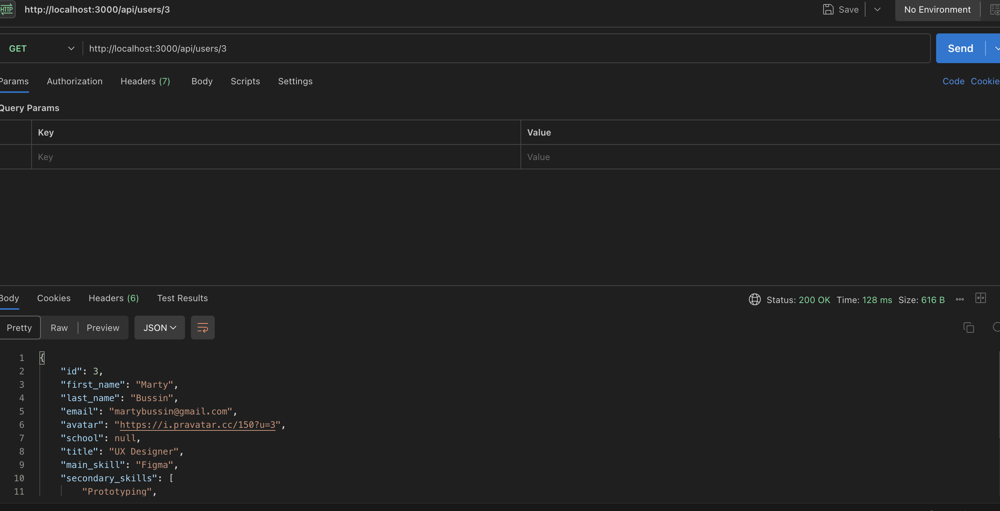

#  PROJECT TITLE  
##  Case Study

This project is a responsive Next.js application that displays a list of users.  
Users can:

- Search by first name, last name, or email
- Filter by Active / Inactive status
- View a detailed profile page for each user
- User data is loaded from a JSON file located inside the project data directory.
- The JSON data is accessed through a Next.js API route.
- You can verify the backend functionality using Postman by sending a GET request.

## Backend API Test

The backend API was tested using Postman.




Live Demo:
https://casestudy-gold.vercel.app/

---

#  TECH STACK

- Next.js (App Router)
- Next. js API route
- React
- Tailwind CSS
- React Icons

---

# INSTALLATION PROCESS

## 1 Creating the Project

npx create-next-app@latest .

During setup:
- Chose App Router
- Chose JavaScript
- Default configuration

This automatically:
- Installed React
- Installed Next.js
- Created project structure
- Enabled file-based routing

---

## 2️ Installing Tailwind CSS

npm install -D tailwindcss@3 postcss autoprefixer
npx tailwindcss init -p

Then:

- Updated tailwind.config.js/postcss content paths
- Added Tailwind directives inside globals.css:

@tailwind base;
@tailwind components;
@tailwind utilities;


---

#  PROJECT STRUCTURE
```
app/
├── layout.js              
├── page.js     #Home page               
├── user/
│   └──page.js.           #UserList  
│   └── [id]/page.js    #UserDetails  /user/[id]/user1 
│──── api/
│    └──users            
│    └── [id]/route.js
│
├── components/
│   ├── Header.js          
│           

data/
└── sample_data.json     
```
---


### This page shows :


Responsive user list layout

Search functionality

Filter by user status (Active / Inactive)

Pagination navigation

### Step 1 — State Management

const [search, setSearch] = useState("")
const [statusOption, setStatusOption] = useState("All")

These states control:
- Search input ( what we can search ? name adn email )
- Active / Inactive filter

---

### Step 2 — Filtering Logic

First filter by status:

if (statusOption === "active") return user.active === true
if (statusOption === "inactive") return user.active === false
return true (this means "All")

**Then filter by search text:**

fullName.includes(searchText) ||
email.includes(searchText)


### Step 3— Pagination Implementation

- Pagination is applied after filtering and searching operations.

- The user list displays 10 users per page.

- Navigation buttons (Prev and Next) are used to switch between pages.

- Pagination state is managed using React state.


